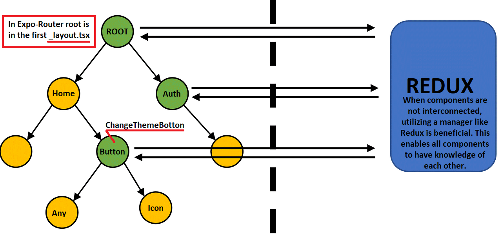

<!-- Banner Image -->

  <a href="https://expo.dev/">
    
    <h1 align="center">Expo Router v2 </h1>
    <h2 align="center">step by step tutorial </h2>
    <h3>We're integrating Redux Toolkit into our application on Expo Router v2, and we continue step by step to build a constructor for static websites and mobile applications</h3>
  </a>
<h5 align="center"> <a aria-label="expo documentation" href="https://maps.menu">We are revamping this: maps.menu 📚</a></h5>

  <a aria-label="try expo with snack" href="https://github.com/bolshiyanov/expo-router-v2-step5"><b>Go back to 5 step</b></a>
 | <a aria-label="try expo with snack" href="https://expo-router-v2-step-by-step6.netlify.app/"><b>Look web site for 6 step</b></a>
 |
  <a aria-label="Redux toolkil for expo-router v2 with typeScript" href="https://github.com/bolshiyanov/expo-router-v2-step6">Next 7 step 📚</a>

---

- [📚 About this step](#-documentation)
- [🗺 Stack of this step](#-Stack-of-this-step)
- [🏅 Why expo-router v2](#-Why-expo-router)
- [❓ FAQ](#-faq)
- [💙 The Team](#-the-team)
- [License](#license)

<h2 align="center">Empowering Smooth State Sharing through Redux Toolkit in the Context of Expo Router V2</h2>

Step by step, we continue crafting a platform where anyone can build a static website for their business and a mobile app using Expo Router v2.

## 📚 About this step

Now we'll teach our components to communicate with each other and pass state, so that changes in one component are immediately visible throughout your application. We'll be using Redux Toolkit and specialized TypeScript hooks for state management.
 

## 🗺  Step-by-Step Guide: 

1) In the terminal run `npm install @reduxjs/toolkit react-redux` for install dependencies 

## 🗺 Stack of this step
`new`
- [`reduxjs/toolkit`](reduxjs/toolkit) A Comprehensive Library for Efficient State Management and Development.

`earlier versions`
- [`local storage`](local-storage) Browser local storage is a feature that allows websites to store data locally on a user's device.
- [`scss`](scss) Supported scss for web.
- [`react-native-svg-transformer`](react-native-svg-transformer) Supported SVG images.
- [`expo-router-v2`](expo-router-v2) Supported static web generation, css , seo.
- [`expo-router`]( expo-router) There is no specific package called "expo-router." Expo uses React Navigation for routing
- [`expo`](expo) Expo is a platform simplifying React Native development through tools, libraries, and workflow enhancements.
- [`react-dom`](react-dom)React package enabling rendering of components in the web browser's DOM (Document Object Model).
- [`react native`](react-native) JavaScript framework for building cross-platform mobile applications.
- [`react`](react) JavaScript library for building user interfaces, maintained by Facebook and a community.
- [`typescript`](typescript) TypeScript is a superset of JavaScript adding static typing for enhanced code quality and tooling.
- [`gitHub`](gitHub) GitHub is a web-based platform for version control and collaboration using Git.
- [`netlify`](netlify) Netlify is a web hosting platform for deploying and managing modern web projects.

## 🏅 Why expo-router v2

 landscape of modern business, the effectiveness of customer acquisition and retention takes on profound importance. The intersection where the cost of drawing in initial customers converges with the metrics of retention and Lifetime Value establishes a pivotal nexus for real-world enterprises. It's within this context that businesses frequently navigate towards the realm of search engine optimization, leveraging its potential to tap into organic traffic from behemoths like Google. 

Undoubtedly, a website serves as an inviting initial point of contact between the business and potential clientele. However, its true value shines when users willingly return, reinforcing the need for a captivating and compelling platform. This brings us to the second interaction with customers, where the objective shifts to providing a seamless, native application experience tailored for iPhones and Android devices. Hence, discerning businesses harmonize their approach by upholding a static website for search engine visibility and a dynamic mobile application for app marketplaces. 

Until recently, achieving such intricate synergy was primarily the domain of expansive teams like Twitter. This involved intricate orchestration of web and native components by scores of developers. Yet, the landscape has metamorphosed with the emergence of Expo Router Version 2. This paradigm shift has overhauled the development process, empowering developers to craft code within a unified ecosystem and effortlessly export the final product as both a static website and a feature-rich app available on the Play Store. 

Moreover, the realm of possibilities has expanded to encompass wearable gadgets, such as the Apple Watch, thanks to Expo Router's extended support. In mere minutes, updates can be seamlessly integrated, thereby revolutionizing the agility with which businesses can refine their offerings. This ushers in an unmatched opportunity to harness the complete potential of the internet, propelling businesses towards the attainment of their goals. 

The democratization of this robust framework marks a monumental stride forward. The once imposing barriers that impeded smaller entities from realizing their digital ambitions have now dissolved. Expo Router introduces an era of accessibility, bestowing entrepreneurs and businesses alike with the means to bridge the gap between their vision and its actualization. As businesses embark on this journey, they gain the capability to enthrall audiences, nurture loyalty, and elevate their digital footprint – all while streamlining the development process in ways that were once the exclusive domain of a select few. 

In a world where triumph pivots on the symbiotic interplay between innovation and execution, Expo Router stands as a testament to technology's power to democratize opportunities. It embodies the shift that has unfolded in the landscape of app and web development – transitioning from the intricate and unwieldy to the intuitive and efficient. As businesses embrace this evolution, they set out on a transformative trajectory, shedding the constraints of the past and venturing into a future where every aspiration for digital resonance and engagement can be woven into reality. 

## 💙 Author

Roman Bolshiyanov < status : open for cooperation, look job >

## License

The Expo source code is made available under the [MIT license](LICENSE). Some of the dependencies are licensed differently, with the BSD license, for example.

